    library(tidyverse)

    ## -- Attaching packages --------------------------------------------------- tidyverse 1.3.0 --

    ## <U+2713> ggplot2 3.2.1     <U+2713> purrr   0.3.3
    ## <U+2713> tibble  2.1.3     <U+2713> dplyr   0.8.3
    ## <U+2713> tidyr   1.0.0     <U+2713> stringr 1.4.0
    ## <U+2713> readr   1.3.1     <U+2713> forcats 0.4.0

    ## -- Conflicts ------------------------------------------------------ tidyverse_conflicts() --
    ## x dplyr::filter() masks stats::filter()
    ## x dplyr::lag()    masks stats::lag()

    library(tidytext)

    ## Warning: package 'tidytext' was built under R version 3.6.2

    library(textclean)

    ## Warning: package 'textclean' was built under R version 3.6.2

    library(textdata)

    ## Warning: package 'textdata' was built under R version 3.6.2

    library(topicmodels)

    ## Warning: package 'topicmodels' was built under R version 3.6.2

    library(genius)

    ## Warning: package 'genius' was built under R version 3.6.2

Retrieve the songs:

    christmas_songs <- readRDS(file="christmas_songs.rds")
    if(!(christmas_songs %>% is.data.frame()))
    {
      tuesdata <- tidytuesdayR::tt_load(2019, week = 52)
      christmas_songs <- tuesdata$christmas_songs
      rm(tuesdata)
      christmas_songs %>% saveRDS(file="christmas_songs.rds")
    }

Retrieve the lyric of songs:

    lyric_df <- readRDS(file="lyric_df.rds")
    if(!(lyric_df %>% is.data.frame()))
    {
      lyric_df <- christmas_songs %>% 
        select("title" = song,
               "artist" = performer,
               songid,
               weekid) %>% 
        add_genius(artist = artist, title = title) %>% 
        select(-lyrics)
    }

some songs are missing lyrics, find the songs missing lyrics:

     missing_lyrics_songs <-  christmas_songs %>% 
      anti_join(lyric_df,by = c("weekid", "songid")) %>% 
      rename(artist= performer )

The songs are missing their lyrics because they have wrong URLs:

    missing_lyrics_songs <- missing_lyrics_songs  %>% 
      mutate( songid = songid  %>% as.character(),
              artist = artist %>% as.character(),
              song   = str_remove(songid,artist ),
              url    = gen_song_url(artist = artist, song = song) )  

Retrieve now the lyrics with the right URLs of songs

    get_missing_lyrics <- function( raw) {
        tryCatch(
          raw["url"] %>% as.character() %>% genius_url() %>% 
            mutate(
            url=raw["url"],
            song=raw["song"],
            instance=raw["instance"] %>% as.double(),
            weeks_on_chart=raw["weeks_on_chart"] %>% as.double(),
            day=raw["day"] %>% as.double(),
            weekid = raw["weekid"],
            artist = raw["artist"],
            previous_week_position=raw["previous_week_position"] %>% as.double(),
            year   = raw["year"] %>% as.double(),
            week_position   = raw["week_position"] %>% as.double(),
            songid = raw["songid"],
            peak_position=raw["peak_position"] %>% as.double(),
            month=raw["month"] %>% as.double()),
          
          
            warning = function(warning) {print(paste("warning:",warning));
                 list(track_title="",line=1,lyric="", songid="TOBEREMOVED", weekid="NA")},
              error   = function(error)   {print(paste("error:", error));
                list(track_title="",line=1,lyric="NA", songid="TOBEREMOVED", weekid="")}) 
    }

    missing_lyrics <- readRDS(file="missing_lyrics.rds")
    if(!(missing_lyrics %>% is.data.frame()))
    {
      missing_lyrics <- missing_lyrics_songs %>% 
        apply(1,get_missing_lyrics) %>% 
        bind_rows() %>% 
         filter(songid!="TOBEREMOVED")
      
      missing_lyrics %>% saveRDS(file="missing_lyrics.rds")
    }

Collect the new calculated lyrics to lyric\_df:

    if(!(lyric_df %>% is.data.frame()))
    { 
    lyric_df <- lyric_df %>% bind_rows(
        missing_lyrics_songs %>% inner_join(missing_lyrics %>% select(lyric,line,track_title,songid,artist), by=c("songid","artist")) )

    lyric_df %>% saveRDS( file = "lyric_df.rds")
    }

Find if there are still missing lyrics:

     missing_lyrics_songs <-  missing_lyrics_songs %>% anti_join(lyric_df)

    ## Joining, by = c("url", "weekid", "week_position", "song", "artist", "songid",
    ## "instance", "previous_week_position", "peak_position", "weeks_on_chart", "year",
    ## "month", "day")

    missing_lyrics_songs %>% select(songid) %>% distinct() %>% nrow()

    ## [1] 13

Including Plots
---------------

You can also embed plots, for example:

    christmas_songs %>% group_by( year) %>% summarise( peak = mean(peak_position), 
                                                       chart = mean(weeks_on_chart) ) %>% tail()

    ## # A tibble: 6 x 3
    ##    year  peak chart
    ##   <dbl> <dbl> <dbl>
    ## 1  2012  11    14.5
    ## 2  2013  47.5  10.7
    ## 3  2014  37.9  10.2
    ## 4  2015  21.8  14.2
    ## 5  2016  18.2  17.8
    ## 6  2017  32.3   9

    christmas_songs %>% group_by( performer) %>% 
      summarise( peak = sum(peak_position), 
                chart = sum(weeks_on_chart),
                 number_songs = n_distinct(songid) ) %>% 
      arrange( desc(peak), desc(chart)) %>%  
      top_n(6) %>% 
      ggplot(aes(performer, chart,color = peak)) + geom_point() 

    ## Selecting by number_songs

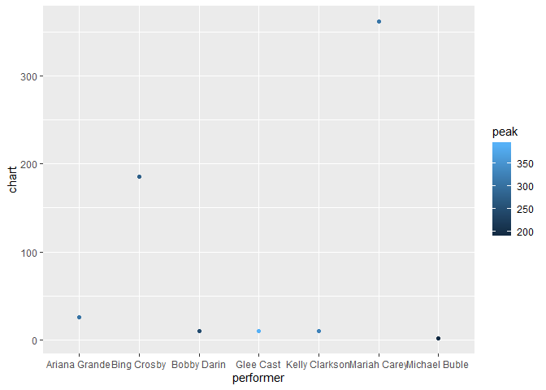

    christmas_songs %>% group_by( performer) %>% 
      summarise( peak = sum(peak_position), 
                chart = sum(weeks_on_chart),
                 number_songs = n_distinct(songid) ) %>% 
      arrange( desc(peak), desc(chart)) %>%  
      top_n(6) %>% 
      ggplot(aes(performer, chart,color = peak)) + geom_point() 

    ## Selecting by number_songs

    christmas_songs %>% group_by( year) %>% 
      summarise( peak = sum(peak_position), 
                chart = sum(weeks_on_chart),
                number_songs = n_distinct(songid) ) %>% 
         ggplot( aes(year,peak)) + 
         geom_col(fill="blue")

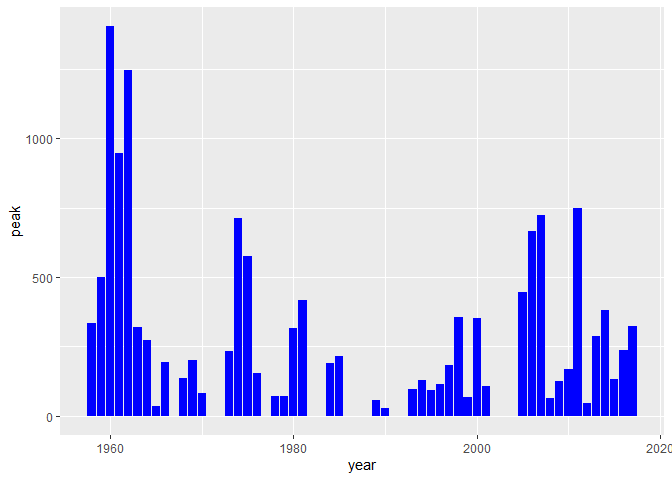

    christmas_songs %>% group_by( year) %>% 
      summarise( "Highest position" = sum(peak_position), 
                "Number of weeks on billboard charts" = sum(weeks_on_chart),
                "Number of songs" = n_distinct(songid) ) %>% 
              gather(key= "key", value="value",-year) %>% 
         ggplot( ) + geom_bar( aes(year,value,fill=key),stat = "identity") +
      coord_flip() 

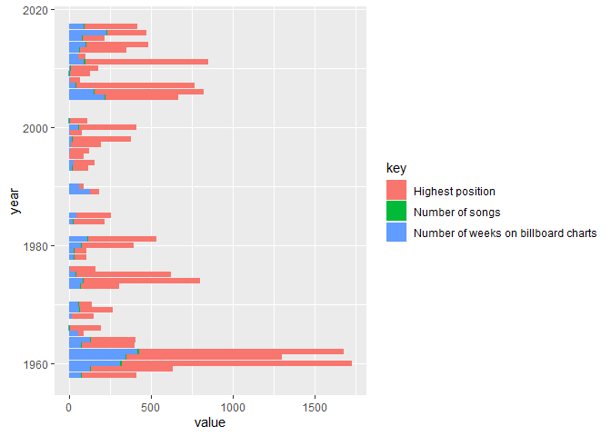

    christmas_songs %>% 
      group_by( year) %>% 
      summarise( "Peaks position" = sum(peak_position),  
                 "Weeks on chart" = sum(weeks_on_chart), 
                 "Number of songs" = n_distinct(songid) ) %>% 
       gather(key="Variable",value="value",-year) %>% 
       ggplot(aes(year,value,width=1)) +
       geom_tile(aes(fill=Variable))

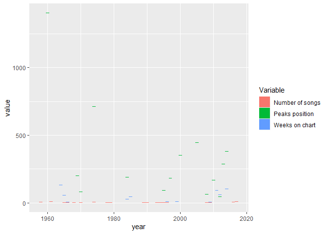

    christmas_songs %>% group_by( year) %>% 
      summarise( "Highest position" = sum(peak_position), 
                "Number of weeks on billboard charts" = sum(weeks_on_chart),
                "Number of songs" = n_distinct(songid) ) %>% 
              gather(key= "Variable", value="value",-year) %>% 
         ggplot( ) + geom_bar( aes(year,value,fill=Variable),stat = "identity")+
         facet_wrap(~Variable) +
         theme(legend.position= "top" )+
          coord_flip() 

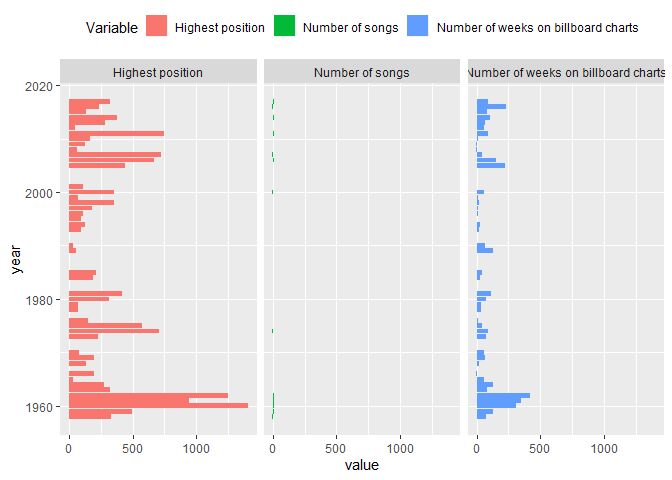

    data(stop_words)

    lyric_df %>% 
      mutate( lyric = replace_contraction(lyric)) %>%  
      unnest_tokens(word,lyric) %>%  
      anti_join( stop_words ) %>% 
      mutate(word = textstem::lemmatize_words(word)) %>%
      count(track_title,word) %>% 
      cast_dtm(track_title,word,n) %>%
      LDA(k=7) %>% 
      tidy(matrix="gamma") %>% 
      rename(track_title = document) %>% 
      mutate(topic = paste("topic",topic,sep = "")) %>% 
      right_join((lyric_df %>% select(songid,track_title))) %>% 
      group_by(track_title,songid,gamma,topic) %>% 
      summarise( topic_count = n()) %>%
      spread(key = topic,value = topic_count , fill=0) %>%
      group_by(songid) %>% 
      summarise( topic1 = sum(topic1), 
                 topic2 = sum(topic2),
                 topic3 = sum(topic3), 
                 topic4 = sum(topic4),
                 topic5 = sum(topic5), 
                 topic6 = sum(topic6),
                 topic7 = sum(topic7), 
                 gamma  = sum(gamma)) %>% 
      gather(key = "topic", value = "value", -songid) %>% 
      arrange(value) %>% 
      ggplot() +
      geom_bar(aes(songid,value,fill=topic), stat="identity",
               position = position_stack(reverse = TRUE)) +
      coord_flip() +
      theme(legend.position = "top")

    ## Joining, by = "word"Joining, by = "track_title"

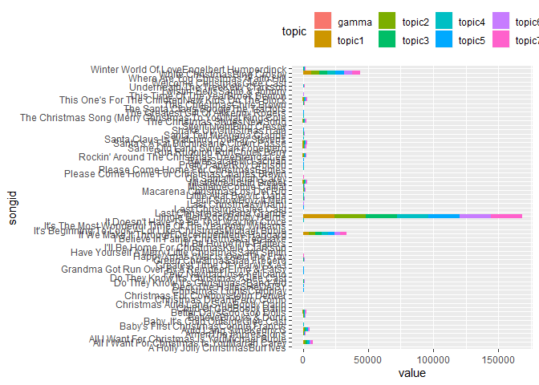

    data(stop_words)

    lyric_df %>% 
      mutate( lyric = replace_contraction(lyric)) %>%  
      unnest_tokens(word,lyric) %>%  
      anti_join( stop_words ) %>% 
      mutate(word = textstem::lemmatize_words(word)) %>%
      count(track_title,word) %>% 
      cast_dtm(track_title,word,n) %>%
      LDA(k=7) %>% 
      tidy(matrix="gamma") %>% 
      rename(track_title = document) %>% 
      mutate(topic = paste("topic",topic,sep = "")) %>% 
      right_join((lyric_df %>% select(year,track_title))) %>% 
      group_by(track_title,year,gamma,topic) %>% 
      summarise( topic_count = n()) %>%
      spread(key = topic,value = topic_count , fill=0) %>%
      group_by(year) %>% 
      summarise( topic1 = sum(topic1), 
                 topic2 = sum(topic2),
                 topic3 = sum(topic3), 
                 topic4 = sum(topic4),
                 topic5 = sum(topic5), 
                 topic6 = sum(topic6),
                 topic7 = sum(topic7), 
                 gamma  = sum(gamma)) %>%
      gather(key = "topic", value = "value", -year) %>% 
      arrange(value) %>% 
      ggplot() +
      geom_bar(aes(year,value,fill=topic), stat="identity",
               position = position_stack(reverse = TRUE)) +
      coord_flip() +
      theme(legend.position = "top")

    ## Joining, by = "word"Joining, by = "track_title"

    ## Warning: Removed 8 rows containing missing values (position_stack).

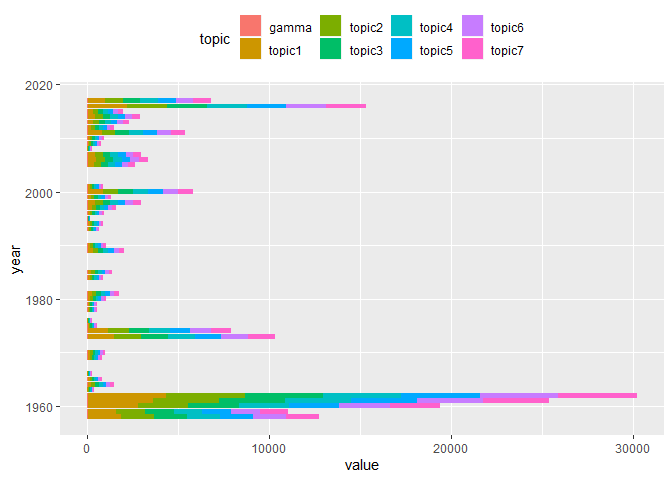

    lyric_df %>% 
      mutate( lyric = replace_contraction(lyric)) %>%  
      unnest_tokens(word,lyric) %>%  
      anti_join( stop_words ) %>% 
      mutate(word = textstem::lemmatize_words(word)) %>%
      count(track_title,word) %>% 
      cast_dtm(track_title,word,n) %>%
      LDA(k=7) %>% 
      tidy(matrix="gamma") %>% 
      rename(track_title = document) %>% 
      mutate(topic = paste("topic",topic,sep = "")) %>% 
      right_join((lyric_df %>% select(songid,track_title))) %>% 
      group_by(track_title,songid,gamma,topic) %>% 
      summarise( topic_count = n()) %>%
      spread(key = topic,value = topic_count , fill=0) %>%
      group_by(songid) %>% 
      summarise( topic1 = sum(topic1), 
                 topic2 = sum(topic2),
                 topic3 = sum(topic3), 
                 topic4 = sum(topic4),
                 topic5 = sum(topic5), 
                 topic6 = sum(topic6),
                 topic7 = sum(topic7), 
                 gamma  = sum(gamma)) %>% 
      gather(key = "topic", value = "value", -songid) %>% 
      ggplot() +
      geom_bar(aes(songid,value,fill=topic),stat="identity", 
               position = position_stack(reverse = TRUE)) +
      coord_flip() +
      theme(legend.position = "top")

    ## Joining, by = "word"Joining, by = "track_title"

    data(stop_words)

    lyric_df %>% 
      mutate( lyric = replace_contraction(lyric)) %>%  
      unnest_tokens(word,lyric) %>%  
      anti_join( stop_words ) %>% 
      mutate(word = textstem::lemmatize_words(word)) %>%
      left_join(get_sentiments("nrc"))   %>% 
      count(year,sentiment,word) %>%  
      spread(key = sentiment,value =n ,fill = 0) %>% 
      group_by(year) %>% 
      summarise(anger = sum(anger), 
                anticipation = sum(anticipation), 
                disgust = sum(disgust), 
                fear = sum(fear),
                joy = sum(joy), 
                negative = sum(negative), 
                positive = sum(positive), 
                sadness= sum(sadness), 
                surprise = sum(surprise), 
                trust = sum(trust)) %>% 
      gather(key = "sentiment", value = "value", -year) %>% 
      ggplot() +
      geom_bar(aes(year,value,fill=sentiment),stat="identity", position = position_stack(reverse = TRUE)) +
      coord_flip() +
      theme(legend.position = "top")

    ## Joining, by = "word"Joining, by = "word"

    ## Warning: Removed 10 rows containing missing values (position_stack).

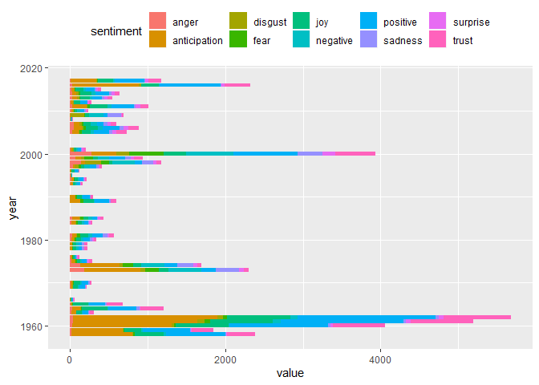

    data(stop_words)

    lyric_df %>% 
      mutate( lyric = replace_contraction(lyric)) %>%  
      unnest_tokens(word,lyric) %>%  
      anti_join( stop_words ) %>% 
      mutate(word = textstem::lemmatize_words(word)) %>%
      left_join(get_sentiments("nrc"))   %>% 
      count(songid,sentiment,word) %>%  
      spread(key = sentiment,value =n ,fill = 0) %>% 
      group_by(songid) %>% 
      summarise(anger = sum(anger), 
                anticipation = sum(anticipation), 
                disgust = sum(disgust), 
                fear = sum(fear),
                joy = sum(joy), 
                negative = sum(negative), 
                positive = sum(positive), 
                sadness= sum(sadness), 
                surprise = sum(surprise), 
                trust = sum(trust)) %>%
      arrange(anger,anticipation,fear,joy,surprise,trust,negative,sadness,positive) %>% 
      head(20) %>% 
      gather(key = "sentiment", value = "value", -songid) %>% 
      ggplot() +
      geom_bar(aes(songid,value,fill=sentiment),stat="identity", position = position_stack(reverse = TRUE)) +
      coord_flip() +
      theme(legend.position = "top")

    ## Joining, by = "word"Joining, by = "word"

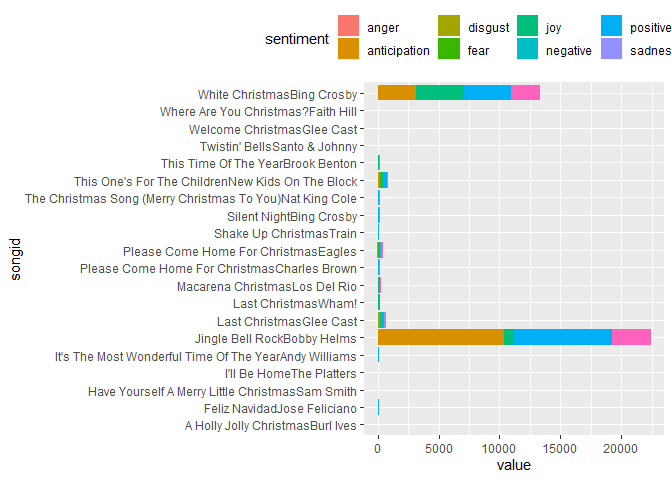

    data(stop_words)

    lyric_df %>% 
      mutate( lyric = replace_contraction(lyric)) %>%
      unnest_tokens(word,lyric) %>%  
      anti_join( stop_words ) %>% 
      mutate(word = textstem::lemmatize_words(word)) %>%
      left_join(get_sentiments("nrc"))   %>% 
      count(songid,peak_position,sentiment,word) %>%
      spread(key = sentiment,value =n ,fill = 0) %>% 
      group_by(songid) %>% 
      summarise(anger = sum(anger), 
                anticipation = sum(anticipation), 
                disgust = sum(disgust), 
                fear = sum(fear),
                joy = sum(joy), 
                negative = sum(negative), 
                positive = sum(positive), 
                sadness= sum(sadness), 
                surprise = sum(surprise), 
                trust = sum(trust),
                peak_position = mean(peak_position)) %>%
      arrange(peak_position) %>% 
      head(20) %>% 
      gather(key = "sentiment", value = "value", -songid) %>% 
      ggplot() +
      geom_bar(aes(songid,value,fill=sentiment),stat="identity", position = position_stack(reverse = TRUE)) +
      coord_flip() +
      theme(legend.position = "top")

    ## Joining, by = "word"Joining, by = "word"

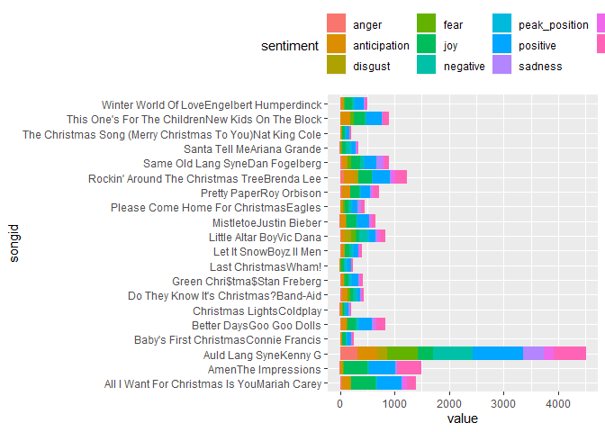

     coord_radar <- function (theta = "x", start = 0, direction = 1) 
     {
       theta <- match.arg(theta, c("x", "y"))
       r <- if (theta == "x") 
         "y"
       else "x"
       ggproto("CordRadar", CoordPolar, theta = theta, r = r, start = start, 
               direction = sign(direction),
               is_linear = function(coord) TRUE)
     } 

    data(stop_words)

    lyric_df %>% 
      mutate( lyric = replace_contraction(lyric)) %>%
      unnest_tokens(word,lyric) %>%  
      anti_join( stop_words ) %>% 
      mutate(word = textstem::lemmatize_words(word)) %>%
      left_join(get_sentiments("nrc"))   %>% 
      count(songid,week_position,sentiment,word) %>%
      spread(key = sentiment,value =n ,fill = 0) %>% 
      group_by(songid) %>% 
      summarise(anger = sum(anger), 
                anticipation = sum(anticipation), 
                disgust = sum(disgust), 
                fear = sum(fear),
                joy = sum(joy), 
                negative = sum(negative), 
                positive = sum(positive), 
                sadness= sum(sadness), 
                surprise = sum(surprise), 
                trust = sum(trust),
                week_position = mean(week_position)) %>%
      
      arrange(week_position) %>% 
      select(songid,anger,sadness,fear,surprise,anticipation,trust) %>%
      head(4) %>% 
      gather(key = "sentiment", value = "value", -songid) %>% 
      ggplot(aes(x=sentiment,y=value)) +
      geom_polygon(aes(group = songid, color = songid), fill = NA,  show.legend = FALSE) +
      geom_line(aes(group = songid, color = songid)) +
       theme(strip.text.x = element_text(size = rel(0.8)),
             axis.text.x = element_text(size = rel(0.8)),
             axis.ticks.y = element_blank(),
             axis.text.y = element_blank()) +
       xlab("") + ylab("") +
       coord_radar()

    ## Joining, by = "word"Joining, by = "word"

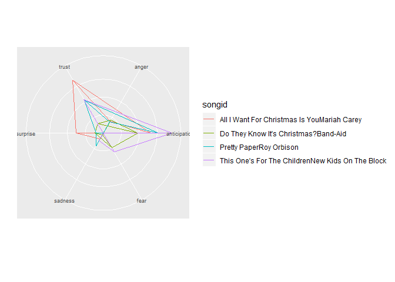

    lyric_df %>% mutate(year=as.factor(year)) %>% 
      mutate( lyric = replace_contraction(lyric)) %>%
      unnest_tokens(word,lyric) %>%  
      anti_join( stop_words ) %>% 
      mutate(word = textstem::lemmatize_words(word)) %>%
      left_join(get_sentiments("nrc"))   %>% 
      count(year,week_position,sentiment,word) %>%
      spread(key = sentiment,value =n ,fill = 0) %>% 
      group_by(year) %>% 
      summarise(anger = sum(anger), 
                anticipation = sum(anticipation), 
                disgust = sum(disgust), 
                fear = sum(fear),
                joy = sum(joy), 
                negative = sum(negative), 
                positive = sum(positive), 
                sadness= sum(sadness), 
                surprise = sum(surprise), 
                trust = sum(trust),
                week_position = mean(week_position)) %>%
      arrange(desc(week_position) )%>% 
      select(year,surprise,trust,joy,positive,sadness) %>%
      head(10) %>% 
      gather(key = "sentiment", value = "value", -year) %>% 
      ggplot(aes(x=sentiment,y=value)) +
      geom_polygon(aes(group = year, color = year), fill = NA,  show.legend = FALSE) +
      geom_line(aes(group = year, color = year)) +
       theme(strip.text.x = element_text(size = rel(0.8)),
             axis.text.x = element_text(size = rel(0.8)),
             axis.ticks.y = element_blank(),
             axis.text.y = element_blank()) +
       xlab("") + ylab("") +
       coord_radar()

    ## Joining, by = "word"Joining, by = "word"

    ## Warning: Factor `year` contains implicit NA, consider using
    ## `forcats::fct_explicit_na`

    ## Warning: Factor `year` contains implicit NA, consider using
    ## `forcats::fct_explicit_na`

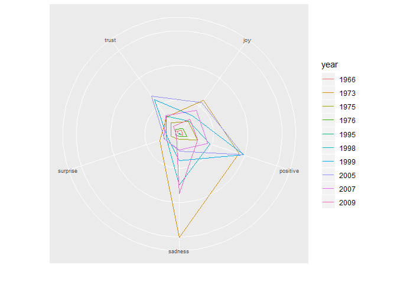

Note that the `echo = FALSE` parameter was added to the code chunk to
prevent printing of the R code that generated the plot.
